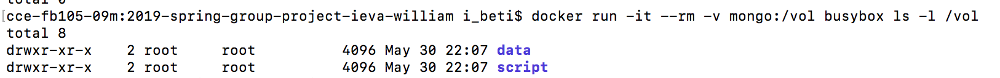

# MongoDB 

- deploy `yml` file containg volume 

` docker stack deploy --compose-file=stack-spark-mongodb.yml spark`

- create a volume named mongo

 `docker volume create mongo`
 
  
 
 - put script and data in the volume 
 
 `docker run --rm -v "$(pwd)"/script:/script -v "$(pwd)"/data:/data -v mongo:/volume busybox cp -r /script/ /volume`
 `docker run --rm -v "$(pwd)"/script:/script -v "$(pwd)"/data:/data -v mongo:/volume busybox cp -r /data/ /volume`
 
 - check that files are indeed in the volume 
 
 ` docker run -it --rm -v mongo:/vol busybox ls -l /vol`
 
 - make sure it is in the worker
 
 `docker exec -it  spark_worker.2.z7mjo52s5usducgkqckw4eez1 sh`
 
 - spark submit
 
 `docker run -t --rm   -v mongo:/usr/spark-2.4.1/volume   --network=spark-network   mjhea0/spark:2.4.1   bin/spark-submit     --master spark://master:7077     --class endpoint   volume/script/mongo.py`
 
 
